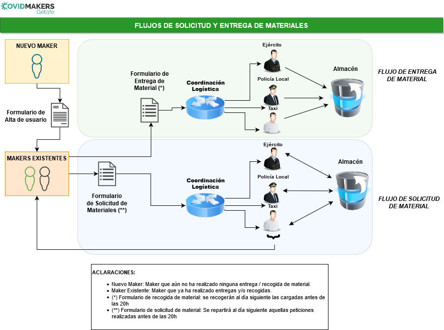

## <a>Proceso completo (datos para el grupo de Getafe)</a>

**Atención:** No es necesario esperar a tener gomas y plásticos transparentes para terminar de montar los protectores. En cuanto tengas tus piezas impresas, se puede organizar ya una entrega. Nos estamos encargando de que en destino haya gomas y pĺásticos, para que puedan montar todo allí. Así que no te preocupes si te falta algo de eso: basta con imprimir piezas. En cualquier caso, si tienes otro material, o decides montar los protectores completos, adelante, acuérdalo así con quien vaya a recoger tu entrega (ver más abajo).

* Antes de empezar: Lee con detalle las [instrucciones sobre cómo imprimir lo que estamos haciendo](#haciendo), elije el modelo a imprimir, calibra tu impresora. Si necesitas ayuda, pregunta en el grupo de fabricación.

* Imprime. Si necesitas ayuda, pregunta en el grupo de fabricación.

* Si estás fabricando, y prevés que te vas a quedar sin PLA, puedes pedir bobinas de las que nos están llegando vía donaciones (no podemos garantizar que tengamos PLA listo para enviarte, pero trataremos de hacerlo). Hazlo cuando te queden como mucho dos días de PLA, rellenando el [formulario de petición de PLA](https://docs.google.com/forms/d/e/1FAIpQLSffZoj04AgMSFzh23fbOKqQNuNHOhQSLAInoCFRcIrRj4AssA/viewform). Trataremos de entregar al día siguiente las peticiones de PLA recibidas antes de las 20:00.

* Cuando tengas material impreso en 3D (al menos 10 piezas), rellena los siguientes formularios:

  - Si es la primera vez que tienes material listo (no se te ha realizado nunca una recogida de material), rellena el [formulario de nuevo maker](https://docs.google.com/forms/d/e/1FAIpQLSdO0WRbIKKgPMfELPCbPK3jvf8paplx6duKgp7iy40mTTmfyw/viewform). Este formulario sólo lo tendrás que rellenar una vez.

  - Si ya se te ha recogido material, o ya has rellenado el formulario de nuevo maker, rellena el [formulario de fabricación lista para ser recogida](https://docs.google.com/forms/d/e/1FAIpQLSf5bpf29waWAVTi_3QRzihBPt8VOsbqQeOZ9phYBQSoqk-IXw/viewform). Puedes rellenar este formulario tantas veces como haga falta, si vas fabricando más piezas, pero sólo una vez cada día (contabilizado entre las 20:00 de un día, y las 20:00 del día siguiente). No tienes que decrementar las piezas que se te recojan, cuando esto ocurra: sólo vas indicando los nuevos lotes de piezas que vayas fabricando.
  
* Desinfecta y empaqueta el material (las piezas imprimidas, y los demás materiales que podamos tener, como hojas de plástico, gomas, etc.) según las [instrucciones de empaquetado y desinfección](#desinfeccion) y espera a que alguien del grupo de logística pase a buscarlo para llevarlo al punto de recogida. Si tienes problemas o dudas, pregunta en el grupo de logística (sobre la desinfección, mira más abajo).

* Imprime y rellena la [hoja de recogida](PROTOCOLO_ACTUACION_ENTREGA_V2.pdf), y tenla lista cuando llegue la persona que se encargará de llevarse tu bolsa. Sobre la primera línea incluye tu nombre, sobre la segunda el nombre de la persona que recogerá tu bolsa, y sobre la tercera, "DOMICILIO" si la recogida es en tu domicilio (o si no, el lugar donde tenga lugar la recogida). Si te fuera imposible imprimir el documento, pregunta a la persona de logística que pase a recoger si te puede llevar uno impreso, o prepara uno a mano.

* Una vez hayas rellenado los formularios anteriores, el grupo de logística se encargará de coordinar con los colaboradores que están haciendo las recogidas (Protección Civil, Policía Municipal, etc.) y las entregas de materiales para que se pasen por tu domicilio lo antes posible. Estate atento a tu teléfono, por si tuvieran que contactar contigo por algún motivo. Si ves que nadie se pone en contacto contigo ni pasa por tu domicilio en un par de días desde que rellenaste los formularios, puedes preguntar en el grupo de Telegram de logística.

* Las personas que se encargan de las recogidas recogerán la bolsa de tu domicilio y la hoja de recogida, y las llevarán al almacén. Allí se organizará su reparto vía Protección Civil de Getafe, que los entregará al hospital u otros organismos necesitados.

### <a name="desinfeccion">Desinfección y empaquetado de material</a>

**Atención: Este proceso deberá realizarse con guantes y mascarilla, para evitar que los materiales que producimos vayan infectados. Al terminar el proceso, es importante realizar una buena limpieza de manos.**

El proceso comienza preparando un pulverizador con líquido desinfectante. Puedes hacerlo de una de las siguientes formas:

* Con gel hidro-alcohólico

- Abrir el desinfectante de uso profesional como gel hidro-alcohólico
- Introducir el gel hidro-alcohólico en un pulverizador

* Con lejía:

- Realizar una mezcla de lejía con agua (1 parte de lejía y 9 partes de agua)
- Introducir la mezcla en un pulverizador

* Con alcohol de 96 grados

- Realizar una mezcla de alcohol de 96 con agua (7 partes de alcohol y 3 partes de agua)
- Introducir la mezcla en un pulverizador

**¡Importante!:** La solución que prepares solo es efectiva durante 24 horas.

Una vez tengas el pulverizador listo, puedes continuar con el procedimiento:

* Prepara una bolsa TRANSPARENTE.
* Introduce en ella la [hoja informativa de desinfección](DESINFECCION.pdf) (que habrás imprimido previamente), escribiendo en ella, en la parte superior, tu usuario de Telegram (por trazabilidad).
* Ponte guante en la mano con la que vas a coger las viseras de una punta y rociar la visera por los dos lados, esperar a que no gotee y meterla en la bolsa transparente.
* Realiza un proceso similar con cualquier otro elemento que incluyas en la bolsa.
* Cuando esté todo en la bolsa, tienes que cerrarla lo más herméticamente que puedas. Para esto, puedes llenar un cubo con agua, sumerges la bolsa con los materiales dentro del cubo, sin que el agua llegue a entrar en la bolsa. Así sale el aire de la bolsa. Inmediatamente, cierra la bolsa con una pinza o un nudo, intentando que quede el mínimo de aire dentro. No olvides pulverizar después la bolsa con desinfectante.

Es importante que las bolsas sean transparentes, para que quien las transporta pueda ver qué hay en ellas.

Antes de su uso, el material debe volver a ser desinfectado (eso va indicado en la hoja informativa de desinfección).

Ten las bolsas listas y desinfectadas antes de que llegue la persona de logística que las lleve al punto de entrega, para evitar esperas innecesarias.
