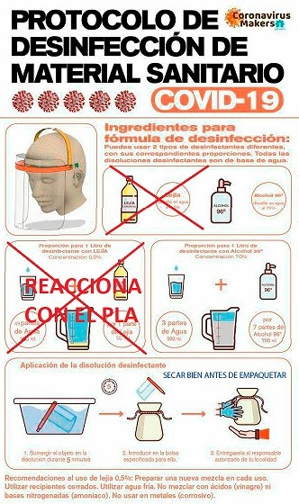

## Proceso completo (datos para el grupo de Getafe)

* [Proceso de fabricación y entrega de lo fabricado](#proceso)
* [Desinfección y empaquetado de lo fabricado](#desinfeccion)
* [Formulario para makers](#formulario)

### <a name="proceso">Proceso de fabricación y entrega de lo fabricado</a>

**Atención:** No es necesario esperar a tener gomas y plásticos transparentes para terminar de montar los protectores. En cuanto tengas tus piezas impresas, se puede organizar ya una entrega. Nos estamos encargando de que en destino haya gomas y pĺásticos, para que puedan montar todo allí. Así que no te preocupes si te falta algo de eso: basta con imprimir piezas. En cualquier caso, si tienes otro material, o decides montar los protectores completos, adelante, acuérdalo así con quien vaya a recoger tu entrega (ver más abajo).

* Antes de empezar: Lee con detalle las [instrucciones sobre cómo imprimir lo que estamos haciendo](#haciendo), elije el modelo a imprimir, calibra tu impresora. Si necesitas ayuda, pregunta en el grupo de fabricación.

* Imprime. Si necesitas ayuda, pregunta en el grupo de fabricación.

* Si estás fabricando, y prevés que te vas a quedar sin PLA, puedes pedir bobinas de las que nos están llegando vía donaciones (no podemos garantizar que tengamos PLA listo para enviarte, pero trataremos de hacerlo). Hazlo cuando te queden como mucho dos días de PLA, rellenando el [formulario de makers](#formulario). Trataremos de entregar al día siguiente las peticiones de PLA recibidas antes de las 20:00.

* Cuando tengas material impreso en 3D (al menos 10 viseras, o 30 salvaorehas), rellena el [formulario de makers(#formulario) para pedir recogida de fabricación. Si es la primera vez que lo haces, tendrás que rellenarlo dos veces: la primera para dar tus datos de contacto, la segunda para solicitar la recogida. Trataremos de organizar la recogida al día siguiente de todo lo que se pida en el formulario antes de las 20:00. Por favor, atención al móvil: seguramente te contactarán antes de pasar a recoger, así evitamos desplazamientos fallidos.
  
* Desinfecta y empaqueta el material (las piezas imprimidas, y los demás materiales que podamos tener, como hojas de plástico, gomas, etc.) según las [instrucciones de empaquetado y desinfección](#desinfeccion) y espera a que alguien del grupo de logística pase a buscarlo para llevarlo al punto de recogida. Si tienes problemas o dudas, pregunta en el grupo de Fabricación (sobre la desinfección, mira más abajo).

* Una vez hayas rellenado el formulario, el grupo de logística se encargará de coordinar con los colaboradores que están haciendo las recogidas (Protección Civil, Policía Municipal, etc.) y las entregas de materiales para que se pasen por tu domicilio lo antes posible. Estate atento a tu teléfono, por si tuvieran que contactar contigo por algún motivo. Si ves que nadie se pone en contacto contigo ni pasa por tu domicilio en un par de días desde que rellenaste los formularios, puedes preguntar en el grupo de Telegram de logística.

* Las personas que se encargan de las recogidas recogerán la bolsa de tu domicilio, y las llevarán al almacén. Allí se organizará su reparto vía Protección Civil de Getafe, que los entregará al hospital u otros organismos necesitados.

### <a name="desinfeccion">Desinfección y empaquetado de lo fabricado</a>

**Atención: Este proceso deberá realizarse con guantes y mascarilla, para evitar que los materiales que producimos vayan infectados. Al terminar el proceso, es importante realizar una buena limpieza de manos.**

El protocolo de desinfección está descrito en esta ilustración (no usar lejía, si dispones de medios, entrega sin desinfectar, y avisa de ello a quien realice la recogida):

**¡Importante!:** La solución que prepares solo es efectiva durante 24 horas.

Asegúrate de que las bolsas sean transparentes, para que quien las transporta pueda ver qué hay en ellas. Ten las bolsas listas y desinfectadas antes de que llegue la persona de logística que las lleve al punto de entrega, para evitar esperas innecesarias.

Antes de su uso, el material debe volver a ser desinfectado.

### <a name="formulario">Formulario para makers</a>

Estamos usando un único formulario para para entregar datos para futuros reconocimientos (tu dirección, tu teléfono, de forma que se te pueda identificar para todo lo demás), para solicitar recogida de materiales fabricados (viseras, salvaorejas, etc.), para solicitar material del que nos están donando (PLA, etc.), para solicitar presupuesto de recambios y/o impresoras 3D (por colaboradores del grupo) y para solicitar asistencia técnica por un maker de Getafe.

En general, tendrás que rellenarlo una vez dando tus datos (si no lo has hecho ya), y luego lo puedes utilizar para cualquiera de las otras acciones (solicitud de recogida, solicitud de material, etc.).

* **[Formulario para Covid Makers Getafe](https://forms.gle/CEgajzvrGYJpzXTS8)**